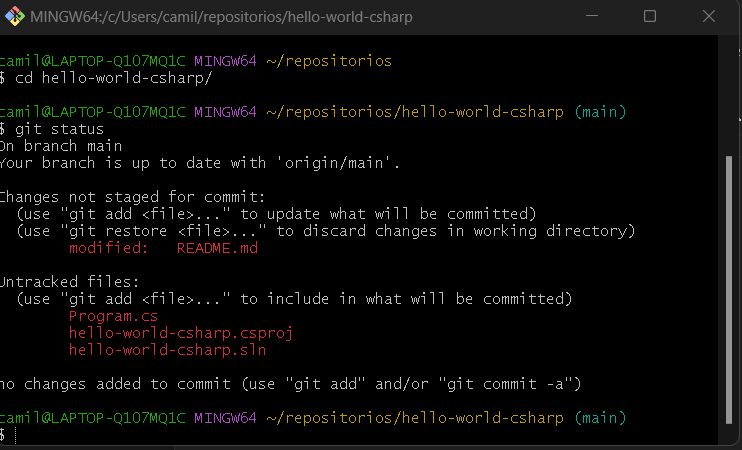
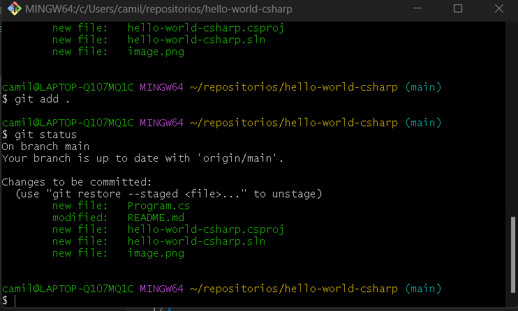
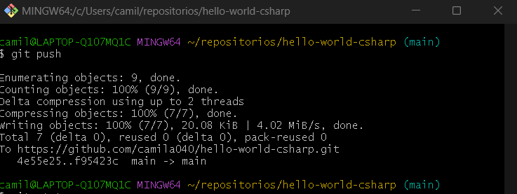

# hello-world-csharp
Repositório de aprendizagem em c#.

## Notas

Nesta aula aprendi como utilizar o git com os seguintes comandos:

* `git clone`: esse comando serve para copiar o repositório que esta no github para minha máquina ;

* `git status`: esse comando serve pra listar todos os arquivos que foram editados ou adicionado por dentro desse repositório:

Conforme é possível ver na imagem acima,os arquivos em vermelho são arquivos foram adicionados e alterados. Agora para poder envia-los para o repositório do github,é necessário fazer os seguintes passos:

* `git add .` :  esse comando serve para a adicionar todos os arquivos na lista de arquivos que vão ser enviados para o repositório do github. Ao fazer o comando `git status`é possível ver que a lista de arquivos, antes vermelha agora estão verdes:

* `git commit -m "mensagem do commit"`: esse comando serve para criar um commit (um grupo de arquivos alterados ou adicionados) para ser enviado ao repositório do github, com uma mensagem,conforme é possível ver abaixo:

* `git push` : esse comando serve para enviar o commit feito acima para o repositório do github online :

